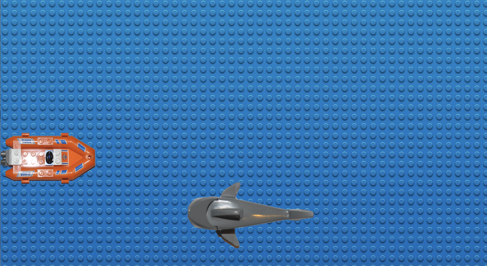

# Casustoets Object oriented programming

## Casusomschrijving

In dit spel is de speler een bootje die haaien probeert te ontwijken.

## Spelregels

- er is 1 speler
- de speler vaart met een bootje naar rechts, boven en naar beneden. Hij kan niet achteruit (naar links) varen.
- vanaf de rechterkant zwemmen haaien met verschillende snelheden van rechts naar links.
- de haaien (en zijn positie aan de rechterkant) worden random gegenereerd.
- de speler moet de haaien proberen te vermijden.
- de speler heeft 3 levens.
- Als een haai de speler raakt, wordt er 1 leven van de speler afgenomen.
- als de speler geen levens meer heeft, dan stopt het spel.
- [optioneel] voeg een tijd toe aan het spel. Dit is het aantal seconden dat de speler geen haai heeft geraakt
- [optioneel] voeg verschillende groottes van haaien toe

## Class diagram

Dit is het basis UML diagram. Breidt het class diagram uit met methoden en attributen die je zelf nodig acht. Je hoeft niet meer classes toe te voegen. Dit mag uiteraard wel.

## Opdracht

Maak het spel zo dat je het spel kan spelen. Implementeer het class diagram en zoveel mogelijk spelregels van het spel. Hou de beoordelingscriteria goed in de gaten.

## Beoordelingscriteria

Nr | Leeropbrengsten | Cesuur
--- | --- | ---
1 | past op een consistente manier indentation in de code toe | 0,2
2 | voorziet de code volgens een standaard afspraak (bijvoorbeeld JSDocs) code van commentaar | 0,4
3 | geeft consistent namen aan variabelen, classes en functies | 0,4
4 | structureert de code in classes met attributen en methoden | 2
5 | past overerving in de code toe om herhaling te voorkomen | 2
6 | geeft types van attributen, parameters en returnwaarden expliciet aan | 2
7 | past encapsulation in een class toe zodat data van de class op een goede manier wordt verborgen voor zijn omgeving | 1
8 | past polymorphisme toe opdat code minimaal wordt herhaalt | 1
9 | past de DRY principes toe zodat complexiteit van de code goed wordt verdeeld in onderhoudbare onderdelen | 1
